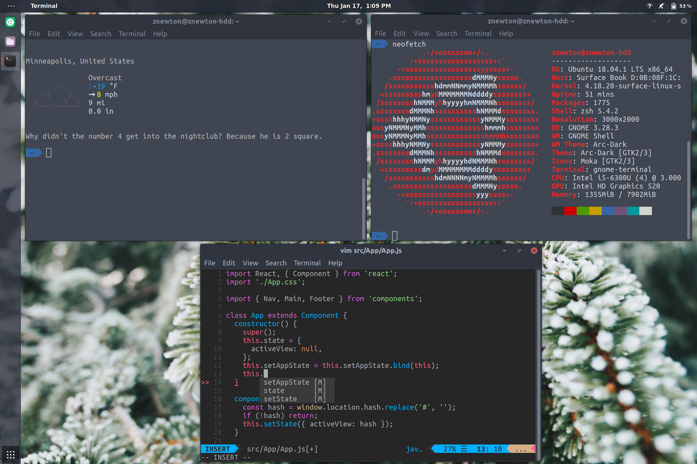

# .dotfiles

My Ubuntu Linux dev environment.

## Highlights

### Easy setup

Automated `setup.sh` script gets everything up and running in a snap. 

Files are linked from the git repo location for easy updating of the repo from local or vice versa.

Saves any old files it overwrites.

### IDE-esque Vim setup

Vim with asynchronous linting, fixing, and autocomplete without any extra configs out-the-box.

Vim airline with one-dark colorscheme.

### Git config

Generated git config with all my favorite aliases, and your Name + Email.

### Packages

Common dev environment packages such as node, python, and openjdk are installed to avoid hastle later on.

## Screenshots

